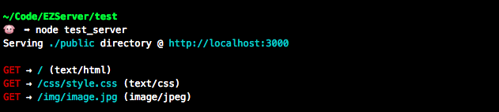

# EZServer

[](https://travis-ci.org/tsck/ezserver)
[](https://www.npmjs.com/package/ezserver)
[](https://github.com/tsck/ezserver/blob/master/LICENSE)

EZServer is a simple static server.

## Download
```bash
$ npm install --save ezserver
```
## Usage
### Create a server
The EZServer class creates a single server object which it will return. The EZServer constructor takes an optional configuration object that can contain three properties (all of which are optional). The properties that can be provided are a root path, a port, and whether console logging should be on or off. The root path will default to the directory where the server is created, the port will default to 3000, and logging will default to true.

```javascript
const EZServer = require('ezserver');
const config = {
  rootPath: './public',
  port: 8000,
  logging: true
};
const server = new EZServer(config);
```
### Starting and Stopping The Server
Once the server has been created, starting and stopping the server is as simple as calling the start and stop methods on the server object.
```javascript
server.start();
server.stop();
```

### Logging
Console logging is turned on be default at server creation, however it can be explicitly set on or off by setting the the logging property on the optional configuration object, passed to the server constructor.

```javascript
const EZServer = require('ezserver');
const server = new EZServer({ logging: true });
```

Below is an example of how the logging will look when turned on:


